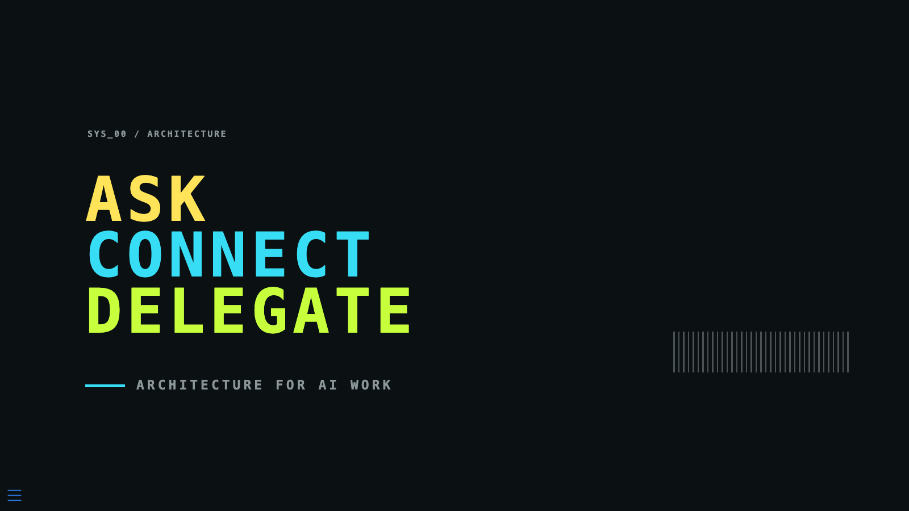

# Ask · Connect · Delegate

**Architecture for AI Work**

An interactive Quarto + Reveal.js presentation built for CIS 565 (Business AI). It argues that putting AI into a business is not a model-choice problem — it is an architecture problem — and works through what that actually involves: what the model is asked to do, what it is connected to, and who decides what happens next.

The question the deck keeps returning to:

> What should we ask AI to do, what should we connect it to, and what should we safely delegate?

**View the live presentation:** <https://rtmandreyev.github.io/ask-connect-delegate/>



**Repository:** <https://github.com/rtmandreyev/ask-connect-delegate>

---

## The idea

A working AI system in a business is rarely one model. It is a composition: models, agents, workflows, tool and context connections, orchestration and governance, human intervention, and bounded decision components that are not general-purpose at all. Treating that as a model-selection decision is what the deck argues against.

It proposes three dimensions for reasoning about the composition:

| Dimension | Question it answers |
| --- | --- |
| **Ask** | What cognition or judgment do we need? |
| **Connect** | What can it reach? |
| **Delegate** | Who chooses what happens next? |

Those three questions carry the talk, and the deck closes on the rule they build toward:

**Delegate where the loop can close. Constrain authority where it can't.**

The dimensions are the presentation's own synthesis, developed from Agrawal, Gans & Goldfarb's prediction/decision framing. They are not a published academic framework, and the closing slide says so on the slide.

## What the presentation covers

Sixteen slides, one argument:

- what a workflow and an agent actually are, and why their control flows differ (`WORKFLOW ≠ AGENT`);
- connectivity versus autonomy — an MCP connection reaches tools and context without choosing the goal, the plan, or the action (`CONNECT ≠ DELEGATE`, `ACCESS ≠ AUTONOMY`);
- end-to-end automation, the exceptions that remain, and where the human boundary moves to instead of disappearing;
- the evidence on human + AI collaboration, including the average case where the combination does not outperform the better solo performer;
- human takeover and intervention inside a running agent;
- authority, reversibility, and blast radius as the variables that actually decide how much autonomy is safe;
- composing orchestration, a shared workspace, an agent worker, connectivity, workflows, and direct APIs into one system;
- bounded, typed decisions as an alternative to open-ended output;
- OpenRouter, free endpoints, and stealth-model experimentation;
- why model selection is becoming "best for what?" rather than "best model?";
- a four-question decision frame to run before delegating anything.

## Selected technologies and examples

Named products appear because they occupy different architectural roles in the argument. Each is an example of a role, not a required stack, and the mention is not an endorsement.

| Example | Role in the argument |
| --- | --- |
| Paperclip | Orchestration and governance above the agent |
| Buzz | A shared workspace where humans and agents work in the same surface |
| Hermes Agent | Agent execution, and human takeover of a running agent |
| MCP | A standard for connecting tools and context |
| n8n | Workflow execution with human-in-the-loop steps |
| Jev / System One | Bounded, typed decisions instead of open-ended output |
| OpenRouter | Model access, free endpoints, stealth releases |
| Inkling / Tinker | A specialist model you adapt yourself |
| Echo | A style and writing specialist |

## Interactive presentation

The deck is published to GitHub Pages straight from `presentation.qmd`:

**<https://rtmandreyev.github.io/ask-connect-delegate/>**

- **Advance:** right / down arrow, or spacebar.
- **Go back:** left / up arrow.
- **Overview and search:** the menu button in the bottom-left corner.
- **Fullscreen:** `f`. **Speaker notes:** `s`.

Slides are hash-addressable, so an individual slide can be linked directly — for example `#/section-9` opens the composition slide, and `#/title-slide` is the title.

## Design and implementation

A dark 1600×900 deck with a fixed colour semantics carried across every slide: acid green for machine execution and delegation, cyan for connection and interfaces, electric yellow for human judgment and uncertainty, and signal red for boundaries, privacy, and constraint. Slides are written as hand-authored HTML blocks inside the Quarto source rather than plain Markdown, so each slide's layout and its fragment build order are controlled individually.

- **Quarto** 1.10.18 with the `revealjs` format
- **Reveal.js** 5.1.0, bundled by Quarto's `revealjs` format
- **Custom SCSS theme** — `theme.scss`, providing the palette, typography, and every per-slide layout rule
- A small number of official product marks in `assets/logos/`, palette-adapted; no JavaScript frameworks and no external runtime dependencies

## Running it locally

Requires [Quarto](https://quarto.org). This deck was authored and verified against Quarto 1.10.18.

```bash
git clone https://github.com/rtmandreyev/ask-connect-delegate.git
cd ask-connect-delegate

quarto preview presentation.qmd   # live preview while editing
quarto render presentation.qmd    # writes presentation.html
```

`presentation_files/` is Quarto's generated asset directory and is gitignored, so a fresh clone must be rendered before `presentation.html` will display correctly on its own. To view an already-rendered copy without Quarto, serve the directory over a local server (for example `python3 -m http.server`) and open the HTML — the deck loads its assets relatively.

GitHub Pages publishes the presentation itself at <https://rtmandreyev.github.io/ask-connect-delegate/>. The site is built by a GitHub Actions workflow (`.github/workflows/publish.yml`), which renders `presentation.qmd` with Quarto, checks that the deck, Reveal.js, and the presentation's assets are all present, and deploys the result as the site root. The `presentation_files/` assets are generated during the build and are not committed.

## Sources

Every substantive slide carries an inline citation to the source supporting its claim, and vendor-reported figures stay attributed on the slide. The closing slide holds the full bibliography — 24 entries covering Anthropic's containment engineering report, Agrawal, Gans & Goldfarb (2018), Anthropic's "Building effective agents," the Model Context Protocol specification, Lemonade's FY2025 Form 10-K, Vaccaro, Almaatouq & Malone in *Nature Human Behaviour* (2024), the Hermes Agent, Paperclip, Buzz, n8n and MCP documentation, TypeSafe AI's System One material, Thinking Machines Lab's Inkling and Tinker, Fulcrum Research's Echo, OpenRouter's stealth and free-model records, and the official pages for the models named on the landscape slide.

Two figures on the deck are deliberately marked as illustrative rather than empirical: the 200-campaigns-a-week scenario, and the example Jev output. The permission statistic is Anthropic-reported telemetry, the claims-automation figure is a company-reported metric from Lemonade's 10-K, and the collaboration result is from the published meta-analysis.

## Main files

| File | Role |
| --- | --- |
| `presentation.qmd` | Presentation source — front matter, slide content, inline citations |
| `theme.scss` | Custom SCSS theme: palette, typography, per-slide layout |
| `presentation.html` | Rendered deck (generated by `quarto render`) |
| `assets/logos/` | Official product marks used on the slides |
| `assets/readme/` | The preview image above |
| `.github/workflows/publish.yml` | Renders the deck and deploys it to GitHub Pages |

## Series

This is the second of two CIS 565 presentations, and a deliberate sequel:

- **[Predict · Explain · Intervene](https://github.com/rtmandreyev/predict-explain-intervene)** — <https://rtmandreyev.github.io/predict-explain-intervene/> — on what AI contributes to a decision: prediction, explanation, and causal intervention answer different business questions.
- **Ask · Connect · Delegate** — this repository — moves outward from the decision to the architecture around it: connectivity, control, authority, and delegation.

## Context

This is coursework — built for CIS 565 and kept here as a standalone presentation artifact. It presents no original research and fits no models. Product names identify architectural roles and illustrate the argument; they are not endorsements, and the composition shown on the architecture slide is labelled on the slide as one possible arrangement rather than a recommended stack.
